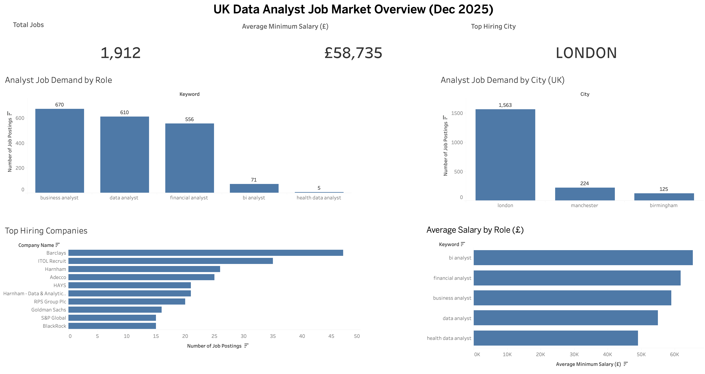
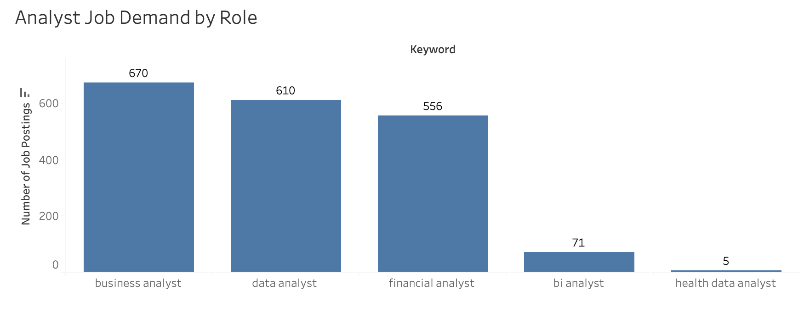
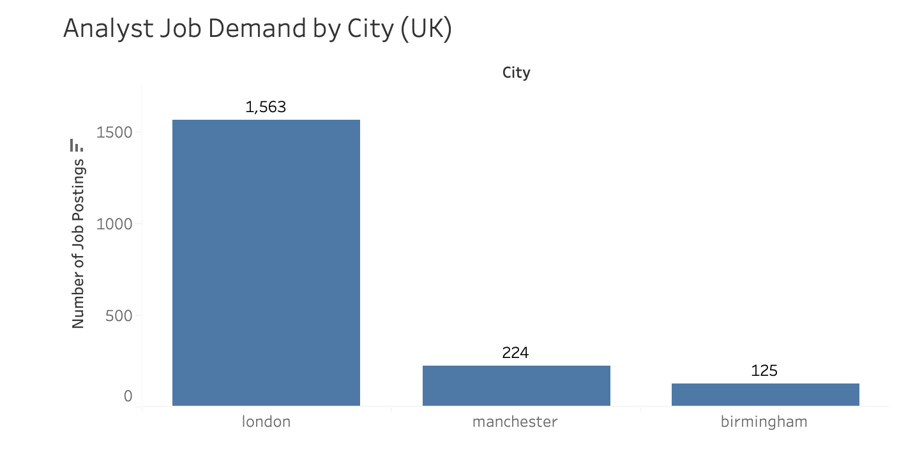
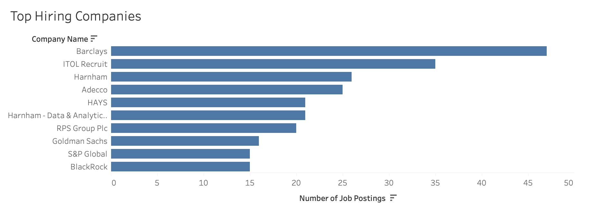
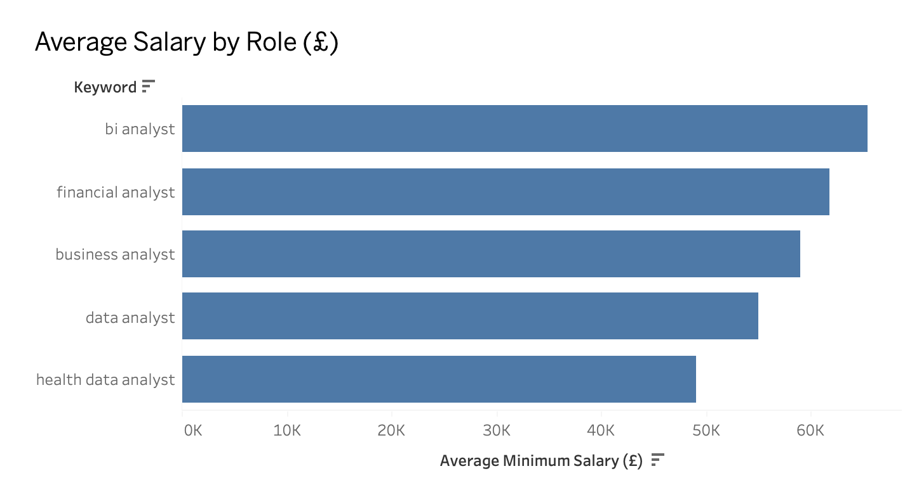

# Architecture

# UK Data Analyst Job Market Dashboard (Dec 2025)

## Overview

This project analyses the UK data analyst job market using live job postings fetched via an external API, rather than static datasets (e.g. Kaggle).

The objective was to replicate a real-world data analyst workflow:

* Ingest live data
* Transform it using SQL
* Surface insights through an interactive dashboard

The final output provides insights into job demand, salary trends, geographic concentration, and top hiring companies for analyst roles across the UK.

---

## Business Questions

1. How many analyst-related roles are currently advertised in the UK?
2. Which analyst roles are most in demand?
3. Which UK cities have the highest concentration of analyst jobs?
4. What is the average minimum advertised salary?
5. Which companies are hiring analysts the most?
6. How does salary differ by analyst role?

---

## Tools & Technologies

* External job postings API (live data)
* AWS S3
* AWS Athena (SQL)
* SQL (aggregation, views)
* Tableau Public
* Python
* Git & GitHub

---

## Data Pipeline

**API → S3 → Glue → Athena → Tableau**

### 1. API Ingestion

* Job postings fetched from an external jobs API using Python
* Data included job title, company, city, salary range, and role keywords

### 2. Storage

* Raw JSON data stored in AWS S3
* Data transformed using AWS Glue (visual ETL)

### 3. Transformation

* Data queried and flattened using AWS Athena
* SQL logic used to:
  * Aggregate job counts
  * Calculate average minimum salaries
  * Rank cities and companies by demand

### 4. Visualisation

* Cleaned datasets connected to Tableau Public
* Interactive dashboard built to explore market trends

---

## Dashboard Overview

### KPI Summary

* **Total Jobs:** 1,912
* **Average Minimum Salary:** £58,735
* **Top Hiring City:** London

---

### Analyst Job Demand by Role

Business Analyst, Data Analyst, and Financial Analyst roles dominate the market, while BI Analyst and Health Data Analyst roles show significantly lower demand.

---

### Analyst Job Demand by City (UK)

London dominates the analyst job market, with Manchester and Birmingham following at a much smaller scale.

---

### Top Hiring Companies

Financial institutions and recruitment firms dominate hiring, with Barclays appearing as the top hiring company in this dataset.

---

### Average Salary by Role

BI Analysts and Financial Analysts have the highest average minimum salaries, while Data Analyst roles show strong demand with slightly lower average pay.

---

## Key Insights

* The UK analyst job market is highly concentrated in London
* Demand is strongest for Business, Data, and Financial Analysts
* Salary levels vary significantly by role, with BI-focused roles paying the most
* Financial services and recruitment firms dominate analyst hiring

---

## Project Approach

This project uses live API data rather than static datasets, following a complete workflow from API ingestion through SQL transformation to final dashboard. The focus was on answering specific business questions rather than just creating visualisations.

---

## Future Enhancements

* Add time-series analysis to track trends over time
* Extract and analyse required skills from job descriptions
* Build a Power BI version for comparison
* Automate daily refresh using AWS Lambda
